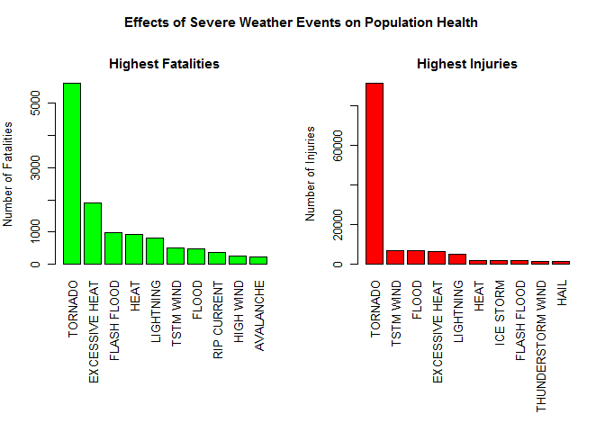
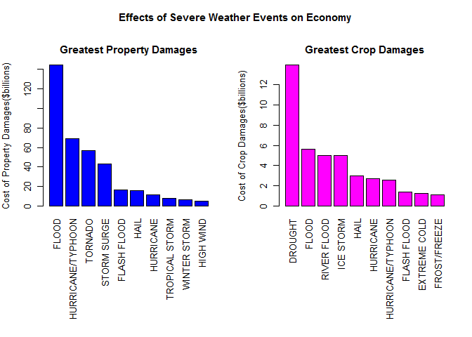

# Reproducible Research: Peer Assessment 2
Vinay Jakkali  
# Impact of Severe Weather Events on Health and Economy  
  
## Synopsis:  

In this Data Analysis report created for the Reproducible Research Peer Assessment 2, we are going to discuss the
various effects of the severe weather events. The analysis is based on the U.S. National Oceanic and Atmospheric
Administration's (NOAA) storm database. THe NOAA keeps track of major storm and weather events happened in the 
U.S. Their database contains, when and where the events occur, estimation of any property damage, injuries and 
fatalities. Storms and other severe weather events have or can cause serious damages to the public health and 
affect the economy of many communities here in the U.S. The key concern is to address the issue and take measures
to prevent such outcomes to the possible extent. Also in this exploratory analysis, we'll try to address two main
concerns, and they are; 

1. Which types of events are most harmful with respect to population health?
2. Which types of events have the greatest economic consequences?

## Data Processing :  

### Loading the data acquired from NOAA for processing  

Loading the R libraries required for this analysis.


```r
library(R.utils)
```

```
## Loading required package: R.oo
## Loading required package: R.methodsS3
## R.methodsS3 v1.7.0 (2015-02-19) successfully loaded. See ?R.methodsS3 for help.
## R.oo v1.19.0 (2015-02-27) successfully loaded. See ?R.oo for help.
## 
## Attaching package: 'R.oo'
## 
## The following objects are masked from 'package:methods':
## 
##     getClasses, getMethods
## 
## The following objects are masked from 'package:base':
## 
##     attach, detach, gc, load, save
## 
## R.utils v2.1.0 (2015-05-27) successfully loaded. See ?R.utils for help.
## 
## Attaching package: 'R.utils'
## 
## The following object is masked from 'package:utils':
## 
##     timestamp
## 
## The following objects are masked from 'package:base':
## 
##     cat, commandArgs, getOption, inherits, isOpen, parse, warnings
```

```r
library(plyr)

library(dplyr)
```

```
## 
## Attaching package: 'dplyr'
## 
## The following objects are masked from 'package:plyr':
## 
##     arrange, count, desc, failwith, id, mutate, rename, summarise,
##     summarize
## 
## The following objects are masked from 'package:stats':
## 
##     filter, lag
## 
## The following objects are masked from 'package:base':
## 
##     intersect, setdiff, setequal, union
```

```r
library(tidyr)
```

```
## 
## Attaching package: 'tidyr'
## 
## The following object is masked from 'package:R.utils':
## 
##     extract
```

```r
library(lattice)

library(ggplot2)

library(knitr)

library(XML)
```


Now unzipping the downloaded data base and then reading the csv file


```r
bunzip2("C:/Users/vinay/Desktop/Coursera/R programing/Reproducible Research/repdata_data_StormData.csv.bz2", "C:/Users/vinay/Desktop/Coursera/R programing/Reproducible Research/StormData.csv", remove = FALSE)


StormData <- read.csv("C:/Users/vinay/Desktop/Coursera/R programing/Reproducible Research/StormData.csv")

head(StormData, 3)
```

```
##   STATE__          BGN_DATE BGN_TIME TIME_ZONE COUNTY COUNTYNAME STATE
## 1       1 4/18/1950 0:00:00     0130       CST     97     MOBILE    AL
## 2       1 4/18/1950 0:00:00     0145       CST      3    BALDWIN    AL
## 3       1 2/20/1951 0:00:00     1600       CST     57    FAYETTE    AL
##    EVTYPE BGN_RANGE BGN_AZI BGN_LOCATI END_DATE END_TIME COUNTY_END
## 1 TORNADO         0                                               0
## 2 TORNADO         0                                               0
## 3 TORNADO         0                                               0
##   COUNTYENDN END_RANGE END_AZI END_LOCATI LENGTH WIDTH F MAG FATALITIES
## 1         NA         0                      14.0   100 3   0          0
## 2         NA         0                       2.0   150 2   0          0
## 3         NA         0                       0.1   123 2   0          0
##   INJURIES PROPDMG PROPDMGEXP CROPDMG CROPDMGEXP WFO STATEOFFIC ZONENAMES
## 1       15    25.0          K       0                                    
## 2        0     2.5          K       0                                    
## 3        2    25.0          K       0                                    
##   LATITUDE LONGITUDE LATITUDE_E LONGITUDE_ REMARKS REFNUM
## 1     3040      8812       3051       8806              1
## 2     3042      8755          0          0              2
## 3     3340      8742          0          0              3
```

```r
dim(StormData)
```

```
## [1] 902297     37
```


Now subsetting the StormData data frame to a smaller data frame for further analysis.


```r
 subdata <- select(StormData,EVTYPE,FATALITIES,INJURIES,PROPDMG,PROPDMGEXP,CROPDMG,CROPDMGEXP)

str(subdata)
```

```
## 'data.frame':	902297 obs. of  7 variables:
##  $ EVTYPE    : Factor w/ 985 levels "   HIGH SURF ADVISORY",..: 834 834 834 834 834 834 834 834 834 834 ...
##  $ FATALITIES: num  0 0 0 0 0 0 0 0 1 0 ...
##  $ INJURIES  : num  15 0 2 2 2 6 1 0 14 0 ...
##  $ PROPDMG   : num  25 2.5 25 2.5 2.5 2.5 2.5 2.5 25 25 ...
##  $ PROPDMGEXP: Factor w/ 19 levels "","-","?","+",..: 17 17 17 17 17 17 17 17 17 17 ...
##  $ CROPDMG   : num  0 0 0 0 0 0 0 0 0 0 ...
##  $ CROPDMGEXP: Factor w/ 9 levels "","?","0","2",..: 1 1 1 1 1 1 1 1 1 1 ...
```

From the structure of the subset data frame, we see that the Property damage exponent and crop damage
exponent columns are of class "factors"  

Now getting the unique value of these columns to see what type of values we are dealing with.


```r
unique(subdata$PROPDMGEXP)
```

```
##  [1] K M   B m + 0 5 6 ? 4 2 3 h 7 H - 1 8
## Levels:  - ? + 0 1 2 3 4 5 6 7 8 B h H K m M
```

```r
unique(subdata$CROPDMGEXP)
```

```
## [1]   M K m B ? 0 k 2
## Levels:  ? 0 2 B k K m M
```


Now converting the factors into the integers:  

Assigning respective exponent values for the property damage exponent and storing them in a new column called "PROPEXP"


```r
subdata$PROPEXP[subdata$PROPDMGEXP == "K"] <- 1000

subdata$PROPEXP[subdata$PROPDMGEXP == "M"] <- 1e+06

subdata$PROPEXP[subdata$PROPDMGEXP == ""] <- 1

subdata$PROPEXP[subdata$PROPDMGEXP == "B"] <- 1e+09

subdata$PROPEXP[subdata$PROPDMGEXP == "m"] <- 1e+06

subdata$PROPEXP[subdata$PROPDMGEXP == "0"] <- 1

subdata$PROPEXP[subdata$PROPDMGEXP == "5"] <- 1e+05

subdata$PROPEXP[subdata$PROPDMGEXP == "6"] <- 1e+06

subdata$PROPEXP[subdata$PROPDMGEXP == "4"] <- 10000

subdata$PROPEXP[subdata$PROPDMGEXP == "2"] <- 100

subdata$PROPEXP[subdata$PROPDMGEXP == "3"] <- 1000

subdata$PROPEXP[subdata$PROPDMGEXP == "h"] <- 100

subdata$PROPEXP[subdata$PROPDMGEXP == "7"] <- 1e+07

subdata$PROPEXP[subdata$PROPDMGEXP == "H"] <- 100

subdata$PROPEXP[subdata$PROPDMGEXP == "1"] <- 10

subdata$PROPEXP[subdata$PROPDMGEXP == "8"] <- 1e+08

#  Assigning 0 to the invalid exponent values

subdata$PROPEXP[subdata$PROPDMGEXP == "+"] <- 0

subdata$PROPEXP[subdata$PROPDMGEXP == "-"] <- 0

subdata$PROPEXP[subdata$PROPDMGEXP == "?"] <- 0

# Now computing the value of the Property damage

subdata$PROPDMGVAL <- subdata$PROPDMG * subdata$PROPEXP
```


Assigning respective exponent values for the crop damage exponent and storing them in a new column called "CROPEXP"


```r
subdata$CROPEXP[subdata$CROPDMGEXP == "M"] <- 1e+06

subdata$CROPEXP[subdata$CROPDMGEXP == "K"] <- 1000

subdata$CROPEXP[subdata$CROPDMGEXP == "m"] <- 1e+06

subdata$CROPEXP[subdata$CROPDMGEXP == "B"] <- 1e+09

subdata$CROPEXP[subdata$CROPDMGEXP == "0"] <- 1

subdata$CROPEXP[subdata$CROPDMGEXP == "k"] <- 1000

subdata$CROPEXP[subdata$CROPDMGEXP == "2"] <- 100

subdata$CROPEXP[subdata$CROPDMGEXP == ""] <- 1

#  Assigning 0 to the invalid exponent values

subdata$CROPEXP[subdata$CROPDMGEXP == "?"] <- 0

# Now computing the value of the Crop damage

subdata$CROPDMGVAL <- subdata$CROPDMG * subdata$CROPEXP
```

Now getting the aggregate values for fatalities, injuries, property damage and crop damage with respect to 
the weather event type.


```r
fatalities <- aggregate(FATALITIES ~ EVTYPE, data = subdata, FUN = sum)

injuries <- aggregate(INJURIES ~ EVTYPE, data = subdata, FUN = sum)

propdmg <- aggregate(PROPDMGVAL ~ EVTYPE, data = subdata, FUN = sum)

cropdmg <- aggregate(CROPDMGVAL ~ EVTYPE, data = subdata, FUN = sum)
```


## Results:  

### 1. Which types of events are most harmful with respect to population health?  

Ordering the fatalities and injuries variables to get highest to lowest damages caused by the weather events
on population health and getting the top 10 values.


```r
fatality_tp_10 <- fatalities[order(-fatalities$FATALITIES), ][1:10, ]

injury_tp_10 <- injuries[order(-injuries$INJURIES), ][1:10, ]
```


Now constructing the bar plots to compare the results for fatalities and injuries.  
  


```r
par(mfrow = c(1, 2), mar = c(12, 4, 3, 2), oma = c(0, 0, 3, 0), mgp = c(3, 1, 0), cex = 0.8)

barplot(fatality_tp_10$FATALITIES, las = 3, names.arg = fatality_tp_10$EVTYPE, main = "Highest Fatalities", ylab = "Number of Fatalities", col = "green")

barplot(injury_tp_10$INJURIES, las = 3, names.arg = injury_tp_10$EVTYPE, main = "Highest Injuries", ylab = "Number of Injuries", col = "red")

title(main = "Effects of Severe Weather Events on Population Health", outer = TRUE)
```

 
  
  
### 2. Which types of events have the greatest economic consequences?   

Ordering the property and crop damage variables to get highest to lowest damages caused by the weather events
on economy and getting the top 10 values.  


```r
propdmg_tp_10 <- propdmg[order(-propdmg$PROPDMGVAL), ][1:10, ]

cropdmg_tp_10 <- cropdmg[order(-cropdmg$CROPDMGVAL), ][1:10, ]
```

Now constructing the bar plots to compare the results for property and crop damages.  
  


```r
par(mfrow = c(1, 2), mar = c(12, 4, 3, 2), oma = c(0, 0, 3, 0), mgp = c(3, 1, 0), cex = 0.8)

barplot(propdmg_tp_10$PROPDMGVAL/(10^9), las = 3, names.arg = propdmg_tp_10$EVTYPE, main = "Greatest Property Damages", ylab = "Cost of Property Damages($billions)", col = "blue")

barplot(cropdmg_tp_10$CROPDMGVAL/(10^9), las = 3, names.arg = cropdmg_tp_10$EVTYPE, main = "Greatest Crop Damages", ylab = "Cost of Crop Damages($billions)", col = "magenta")

title(main = "Effects of Severe Weather Events on Economy", outer = TRUE)
```

 
  
  
## Conclusion:  

According to the NOAA storm database, across the U.S. the most harmful weather event causing more damage to
the population health is Tornado. It is the cause for both the highest fatalities and the highest injuries.
It can also see that the severe weather events have the greatest economic consequences. Across the U.S.,
Flood, Tornado and Typhoon have caused the greatest damage to properties, mean while Drought and Flood have
caused the greatest damage to crops.


